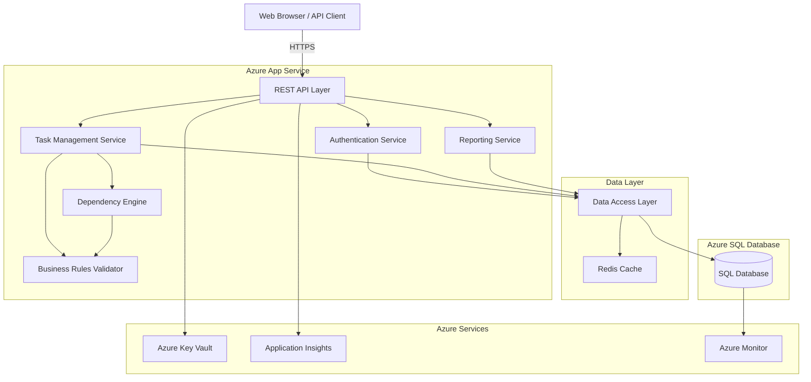
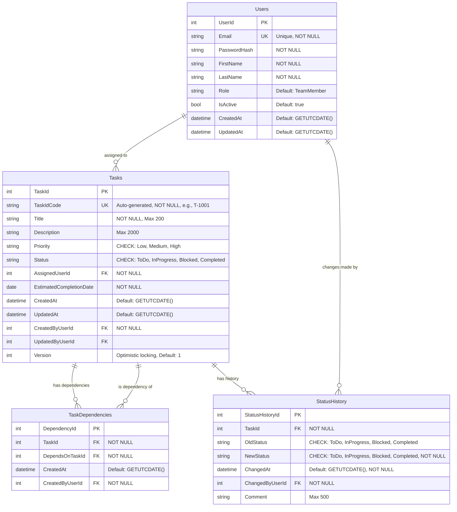
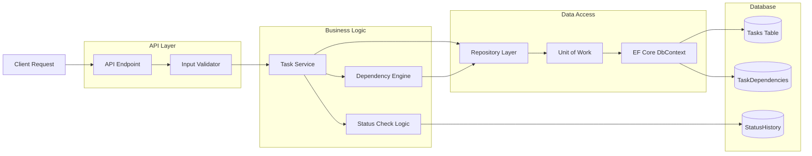
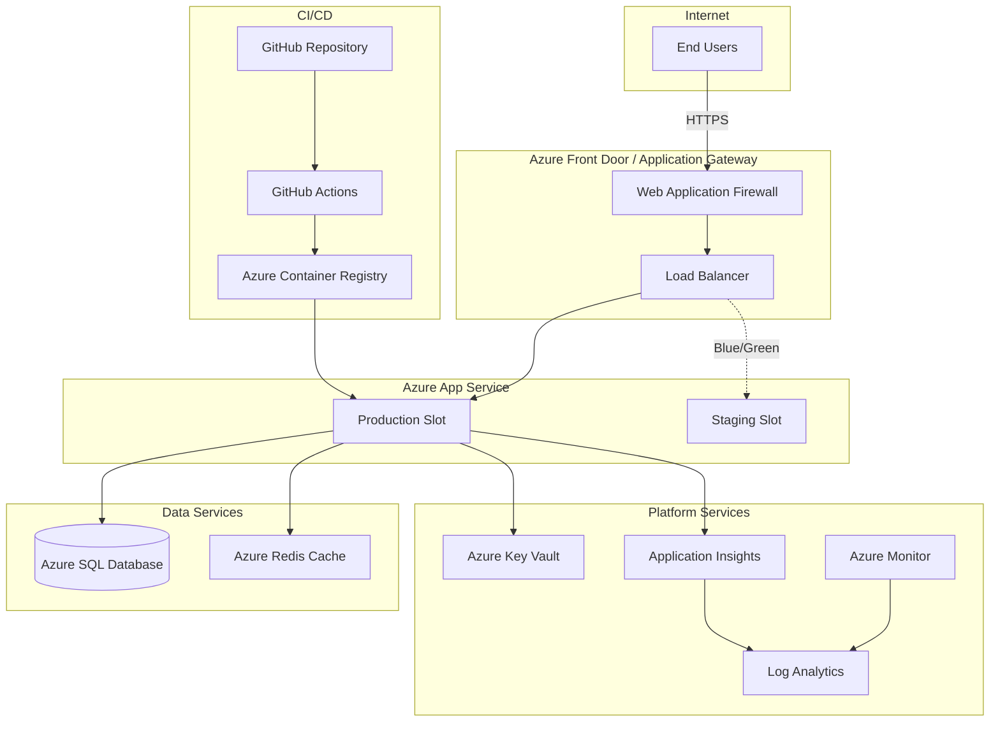

# Technical Specification Document
## Intelligent Task Management System

**Document Version:** 1.0  
**Date:** March 17, 2026  
**Prepared By:** Software Architecture Team  
**Project Sponsor:** Engineering Manager

---

## 1. Technical Overview

The Intelligent Task Management System is a cloud-native, RESTful web application designed to provide teams with a lightweight, dependency-aware task management solution. The system implements a three-tier architecture (presentation, business logic, data) to ensure separation of concerns, maintainability, and scalability.

**Core Technical Capabilities:**
- RESTful API backend exposing task management, dependency tracking, and reporting endpoints
- JWT-based authentication and authorization
- Real-time dependency validation and automatic blocker detection
- High-performance relational database with optimized indexing for filtering operations
- Modular, testable architecture with 80%+ code coverage
- Containerized deployment to Azure with automated CI/CD pipeline

The system is optimized to support 100 concurrent users managing up to 10,000 active tasks with sub-2-second response times for 95% of operations.

---

## 2. System Architecture

### 2.1 Architecture Style

The system follows a **three-tier layered architecture** pattern with clear separation of concerns:

1. **Presentation Layer**: Web UI (future) and API clients
2. **Business Logic Layer**: RESTful API, business rules, dependency validation
3. **Data Access Layer**: Database abstraction, ORM, transaction management

**Rationale**: 
- Traces to **BR-NF-001** (Modular Architecture): Layered architecture ensures maintainability and testability
- Traces to **BO-005** (Minimize adoption friction): RESTful APIs enable easy integration with various clients
- Traces to **BR-NF-007** (Data Integrity): Clear separation allows proper transaction management

### 2.2 High-Level Component Diagram



### 2.3 Key Design Decisions

| Decision | Rationale | BRD Traceability |
|---|---|---|
| RESTful API architecture | Industry standard, stateless, cacheable, supports multiple clients | BR-F-001 to BR-F-015, BR-NF-003 |
| Three-tier layered architecture | Clear separation of concerns, testability, maintainability | BR-NF-001, BR-NF-002 |
| Azure SQL Database | Relational data with ACID guarantees, strong consistency for task dependencies | BR-NF-007, BR-R-006 |
| Redis caching layer | Improve performance for frequently accessed data (progress summaries, user data) | BR-NF-005 (Performance) |
| Dependency Engine as separate service | Isolates complex dependency validation logic for testing and reuse | BR-F-006, BR-F-007, BR-R-005 |
| JWT authentication | Stateless, scalable, industry standard for API authentication | BR-F-015, BR-R-008 |
| Azure App Service hosting | PaaS reduces operational overhead, built-in scaling, CI/CD integration | BR-NF-006, BO-002 |

---

## 3. Technology Stack Recommendations

| Layer | Technology | Version | Justification | BRD Traceability |
|---|---|---|---|---|
| **Backend Framework** | ASP.NET Core | 8.0 LTS | Enterprise-grade, high performance, cross-platform, excellent Azure integration, built-in dependency injection | BR-NF-001, BR-NF-005 |
| **Language** | C# | 12.0 | Type-safe, modern language features (records, pattern matching), strong tooling, Azure SDK support | BR-NF-001, BR-NF-008 |
| **API Protocol** | REST / HTTP | 1.1/2.0 | Stateless, cacheable, well-understood, broad client support | BR-NF-003 |
| **Database** | Azure SQL Database | Latest | ACID compliance, strong consistency, managed service, automatic backups, active geo-replication | BR-NF-007, BR-R-006 |
| **ORM** | Entity Framework Core | 8.0 | Type-safe LINQ queries, migration management, change tracking, excellent performance | BR-NF-007 |
| **Caching** | Azure Redis Cache | 6.x | In-memory performance, distributed caching, pub/sub for cache invalidation | BR-NF-005 |
| **Authentication** | Azure AD B2C / JWT | - | Managed identity service, OAuth 2.0/OIDC compliant, MFA support, JWT for API auth | BR-F-015, R-010 |
| **API Documentation** | Swagger/OpenAPI | 3.0 | Interactive documentation, code generation, industry standard | BR-NF-003, R-009 |
| **Testing Framework** | xUnit + Moq | Latest | Industry standard for .NET, excellent mocking support, parallel test execution | BR-NF-002 |
| **Code Coverage** | Coverlet + ReportGenerator | Latest | Integrated with .NET tooling, supports multiple output formats | BR-NF-002 |
| **CI/CD** | GitHub Actions + Azure DevOps | - | Native GitHub integration, Azure deployment automation, free for open source | BR-NF-004 |
| **Containerization** | Docker | Latest | Consistent environments, easy deployment, scaling | BR-NF-006 |
| **Hosting** | Azure App Service (Linux) | - | PaaS, auto-scaling, deployment slots, integrated monitoring | BR-NF-006, BO-002 |
| **Secrets Management** | Azure Key Vault | - | Centralized secret storage, automatic rotation, audit logging | R-010 |
| **Monitoring** | Application Insights | - | APM, distributed tracing, real-time metrics, alerting | BR-NF-005, BR-NF-009 |
| **Logging** | Serilog + Application Insights | Latest | Structured logging, multiple sinks, performance optimized | BR-NF-009 |

**Technology Stack Rationale:**
- **Azure-Centric**: All services leverage Azure PaaS offerings for reduced operational overhead (traces to **BO-002**)
- **.NET Ecosystem**: Mature, performant, excellent Azure integration, strong typing reduces bugs (traces to **BR-NF-008**)
- **Managed Services**: Azure SQL, Redis Cache, Key Vault minimize DevOps burden (traces to **BO-005**)
- **Industry Standards**: REST, OpenAPI, JWT ensure interoperability and developer familiarity (traces to **BR-NF-003**, **R-009**)

---

## 4. Data Architecture

### 4.1 Entity-Relationship Diagram



### 4.2 Core Entities

#### Users
**Purpose**: Store user account information for authentication and task assignment (traces to **BR-F-004**, **BR-F-015**)

**Key Attributes**:
- `UserId`: Auto-increment primary key
- `Email`: Unique identifier for login
- `PasswordHash`: Bcrypt hashed password (never store plaintext)
- `Role`: TeamMember, TeamLead, Admin (future RBAC support)
- `IsActive`: Soft delete flag

**Indexes**:
- PRIMARY KEY on `UserId`
- UNIQUE INDEX on `Email`
- INDEX on `IsActive` for active user queries

#### Tasks
**Purpose**: Core entity representing work items (traces to **BR-F-001**, **BR-R-001**, **BR-R-002**)

**Key Attributes**:
- `TaskId`: Auto-increment primary key
- `TaskIdCode`: Human-readable unique identifier (e.g., "T-1001")
- `Priority`: ENUM (Low, Medium, High) - traces to **BR-F-002**, **BR-R-003**
- `Status`: ENUM (ToDo, InProgress, Blocked, Completed) - traces to **BR-F-003**, **BR-R-004**
- `AssignedUserId`: Foreign key to Users - traces to **BR-F-004**, **BR-R-008**
- `EstimatedCompletionDate`: Required due date - traces to **BR-R-009**
- `Version`: Optimistic locking for concurrency control - traces to **BR-NF-007**, **R-004**

**Indexes**:
- PRIMARY KEY on `TaskId`
- UNIQUE INDEX on `TaskIdCode`
- INDEX on `Status` for filtering (traces to **BR-F-009**)
- INDEX on `Priority` for filtering (traces to **BR-F-010**)
- INDEX on `AssignedUserId` for filtering (traces to **BR-F-011**)
- INDEX on `EstimatedCompletionDate` for filtering (traces to **BR-F-012**)
- COMPOSITE INDEX on `(Status, AssignedUserId)` for common queries

#### TaskDependencies
**Purpose**: Many-to-many relationship representing task dependencies (traces to **BR-F-006**, **BR-F-007**, **BR-R-005**)

**Key Attributes**:
- `TaskId`: Task that has a dependency
- `DependsOnTaskId`: Task that must be completed first
- CONSTRAINT: `TaskId != DependsOnTaskId` (no self-dependency)

**Indexes**:
- PRIMARY KEY on `DependencyId`
- UNIQUE INDEX on `(TaskId, DependsOnTaskId)`
- INDEX on `TaskId` for dependency lookups
- INDEX on `DependsOnTaskId` for reverse dependency lookups

#### StatusHistory
**Purpose**: Immutable audit trail of status changes (traces to **BR-F-008**, **BR-R-007**)

**Key Attributes**:
- `StatusHistoryId`: Auto-increment primary key
- `TaskId`: Foreign key to Tasks
- `OldStatus`, `NewStatus`: Status transition
- `ChangedAt`: Timestamp (UTC)
- `ChangedByUserId`: User who made the change

**Indexes**:
- PRIMARY KEY on `StatusHistoryId`
- INDEX on `TaskId` for history retrieval
- INDEX on `ChangedAt` for temporal queries

**Table Constraints**: INSERT-only, no UPDATE/DELETE allowed

### 4.3 Data Flow Diagram



### 4.4 Data Integrity Constraints

| Constraint | Implementation | BRD Traceability |
|---|---|---|
| Unique Task IDs | Auto-increment PK + unique TaskIdCode | BR-R-001 |
| Required fields validation | NOT NULL constraints + API validation | BR-R-002 |
| Valid priority values | CHECK constraint + ENUM type | BR-R-003 |
| Valid status values | CHECK constraint + ENUM type | BR-R-004 |
| No self-dependencies | CHECK constraint: `TaskId != DependsOnTaskId` | BR-R-005 |
| Valid user assignment | FOREIGN KEY constraint to Users table | BR-R-008 |
| Future completion dates | CHECK constraint + API validation | BR-R-009 |
| Status history immutability | Table permissions: INSERT only, no UPDATE/DELETE | BR-R-007 |
| Concurrent update safety | Optimistic locking via `Version` field | BR-NF-007 |

---

## 5. API Design

### 5.1 API Design Principles

- **Base URL**: `https://api.taskmgmt.azure.com/api/v1`
- **Versioning Strategy**: URI versioning (`/v1`, `/v2`) for major breaking changes
- **Authentication**: JWT Bearer tokens in `Authorization` header
- **Content-Type**: `application/json` for all requests and responses
- **HTTP Methods**: Standard REST semantics (GET, POST, PUT, PATCH, DELETE)
- **Error Handling**: Consistent error response schema with RFC 7807 Problem Details

**Rationale**: Traces to **BR-NF-003** (API Documentation), **R-009** (API standards), **BO-005** (minimal learning curve)

### 5.2 Authentication & Authorization

#### 5.2.1 Authentication Endpoints

| Method | Endpoint | Purpose | Request Body | Response | BRD Trace |
|---|---|---|---|---|---|
| POST | `/auth/register` | Register new user | `{ email, password, firstName, lastName }` | `{ userId, token }` | BR-F-015 |
| POST | `/auth/login` | Authenticate user | `{ email, password }` | `{ token, refreshToken, expiresIn }` | BR-F-015 |
| POST | `/auth/refresh` | Refresh access token | `{ refreshToken }` | `{ token, refreshToken, expiresIn }` | BR-F-015 |
| POST | `/auth/logout` | Invalidate tokens | `{ refreshToken }` | `204 No Content` | BR-F-015 |
| POST | `/auth/change-password` | Change user password | `{ oldPassword, newPassword }` | `204 No Content` | R-010 |

#### 5.2.2 JWT Token Structure

```json
{
  "sub": "12345",
  "email": "user@example.com",
  "name": "John Doe",
  "role": "TeamMember",
  "iat": 1711468800,
  "exp": 1711555200
}
```

**Token Expiration**: 
- Access Token: 1 hour
- Refresh Token: 7 days

**Rationale**: Short-lived access tokens + refresh tokens balance security and UX (traces to **R-010**)

### 5.3 User Management Endpoints

| Method | Endpoint | Purpose | Request Body | Response | Auth Required | BRD Trace |
|---|---|---|---|---|---|---|
| GET | `/users` | List all users | - | `{ users: [...] }` | Yes | BR-F-004 |
| GET | `/users/{id}` | Get user details | - | `{ userId, email, firstName, lastName, role }` | Yes | BR-F-015 |
| GET | `/users/me` | Get current user | - | `{ userId, email, firstName, lastName, role }` | Yes | BR-F-015 |
| PUT | `/users/{id}` | Update user profile | `{ firstName, lastName }` | `{ userId, ... }` | Yes | BR-F-015 |
| DELETE | `/users/{id}` | Deactivate user | - | `204 No Content` | Yes (Admin) | BR-F-015 |

### 5.4 Task Management Endpoints

| Method | Endpoint | Purpose | Request Body | Response | BRD Trace |
|---|---|---|---|---|---|
| **POST** | `/tasks` | Create new task | See schema below | `{ taskId, taskIdCode, ... }` | BR-F-001 |
| **GET** | `/tasks` | List tasks (paginated, filtered) | Query params | `{ tasks: [...], totalCount, pageSize, pageNumber }` | BR-F-009-012 |
| **GET** | `/tasks/{id}` | Get task details | - | `{ taskId, title, description, ... }` | BR-F-014 |
| **PUT** | `/tasks/{id}` | Update task (full) | See schema below | `{ taskId, ... }` | BR-F-014 |
| **PATCH** | `/tasks/{id}` | Update task (partial) | Partial schema | `{ taskId, ... }` | BR-F-014 |
| **DELETE** | `/tasks/{id}` | Delete task | - | `204 No Content` | IS-001 |
| **PATCH** | `/tasks/{id}/status` | Update task status | `{ status }` | `{ taskId, status, ... }` | BR-F-003 |
| **GET** | `/tasks/{id}/history` | Get status history | - | `{ history: [...] }` | BR-F-008 |

#### 5.4.1 Create Task Request Schema

```json
{
  "title": "Implement Payment API",
  "description": "Create RESTful API for payment processing",
  "priority": "High",
  "status": "ToDo",
  "assignedUserId": 5,
  "estimatedCompletionDate": "2026-04-15"
}
```

**Validation Rules** (traces to **BR-R-002**):
- `title`: required, max 200 chars
- `description`: optional, max 2000 chars
- `priority`: required, enum [Low, Medium, High]
- `status`: required, enum [ToDo, InProgress, Blocked, Completed]
- `assignedUserId`: required, must exist in Users table
- `estimatedCompletionDate`: required, must be today or future date

#### 5.4.2 List Tasks Query Parameters

| Parameter | Type | Description | Example | BRD Trace |
|---|---|---|---|---|
| `status` | string | Filter by status | `?status=InProgress` | BR-F-009 |
| `priority` | string | Filter by priority | `?priority=High` | BR-F-010 |
| `assignedUserId` | int | Filter by assigned user | `?assignedUserId=5` | BR-F-011 |
| `dueDateFrom` | date | Filter by due date range (start) | `?dueDateFrom=2026-03-01` | BR-F-012 |
| `dueDateTo` | date | Filter by due date range (end) | `?dueDateTo=2026-03-31` | BR-F-012 |
| `pageNumber` | int | Page number (1-based) | `?pageNumber=2` | BR-NF-005 |
| `pageSize` | int | Items per page (default 20, max 100) | `?pageSize=50` | BR-NF-005 |
| `sortBy` | string | Sort field | `?sortBy=estimatedCompletionDate` | BO-004 |
| `sortOrder` | string | Sort direction [asc, desc] | `?sortOrder=desc` | BO-004 |

**Multiple Filters**: Can be combined, e.g., `?status=InProgress&priority=High&assignedUserId=5`

### 5.5 Task Assignment Endpoints

| Method | Endpoint | Purpose | Request Body | Response | BRD Trace |
|---|---|---|---|---|---|
| **PUT** | `/tasks/{id}/assign` | Assign task to user | `{ assignedUserId }` | `{ taskId, assignedUserId, ... }` | BR-F-004 |
| **PUT** | `/tasks/{id}/reassign` | Reassign task | `{ assignedUserId }` | `{ taskId, assignedUserId, ... }` | BR-F-005 |
| **GET** | `/users/{id}/tasks` | Get tasks assigned to user | Query params | `{ tasks: [...] }` | BR-F-011 |

### 5.6 Task Dependency Endpoints

| Method | Endpoint | Purpose | Request Body | Response | BRD Trace |
|---|---|---|---|---|---|
| **POST** | `/tasks/{id}/dependencies` | Add dependency | `{ dependsOnTaskId }` | `{ dependencyId, taskId, dependsOnTaskId }` | BR-F-006 |
| **GET** | `/tasks/{id}/dependencies` | Get task dependencies | - | `{ dependencies: [...] }` | BR-F-006 |
| **DELETE** | `/tasks/{id}/dependencies/{depId}` | Remove dependency | - | `204 No Content` | BR-F-006 |
| **GET** | `/tasks/{id}/blocked-by` | Get blocking tasks | - | `{ blockingTasks: [...] }` | BR-F-007 |
| **GET** | `/tasks/{id}/blocking` | Get tasks this blocks | - | `{ blockedTasks: [...] }` | BR-F-007 |

#### 5.6.1 Dependency Validation

**Business Rules Enforced** (traces to **BR-R-005**, **R-005**):
1. Task cannot depend on itself
2. Circular dependency detection (A→B→C→A)
3. Both tasks must exist
4. Duplicate dependencies rejected

**Automatic Blocker Detection** (traces to **BR-F-007**, **BR-R-006**):
- When a dependency is added, check if dependent task's status should be "Blocked"
- When a task status changes to "Completed", check if any blocked tasks can be unblocked
- Blocker status updates are automatic and logged in StatusHistory

### 5.7 Reporting Endpoints

| Method | Endpoint | Purpose | Response | BRD Trace |
|---|---|---|---|---|---|
| **GET** | `/reports/progress` | Project progress summary | `{ totalTasks, completed, inProgress, blocked, toDo }` | BR-F-013 |
| **GET** | `/reports/user-workload` | Tasks by user | `{ users: [{ userId, name, taskCount, ... }] }` | BO-003 |
| **GET** | `/reports/overdue-tasks` | Tasks past due date | `{ overdueTasks: [...] }` | BO-001 |
| **GET** | `/reports/blocked-tasks` | All blocked tasks | `{ blockedTasks: [...] }` | BO-002 |
| **GET** | `/reports/priority-distribution` | Tasks by priority | `{ low: 10, medium: 20, high: 5 }` | BO-004 |

**Response Example for `/reports/progress`**:

```json
{
  "totalTasks": 20,
  "completed": 8,
  "inProgress": 6,
  "blocked": 2,
  "toDo": 4,
  "completionPercentage": 40.0,
  "generatedAt": "2026-03-17T10:30:00Z"
}
```

### 5.8 Standard Error Response Schema

Following RFC 7807 Problem Details (traces to **BR-NF-009**):

```json
{
  "type": "https://api.taskmgmt.azure.com/errors/validation-error",
  "title": "Validation Error",
  "status": 400,
  "detail": "The title field is required.",
  "instance": "/api/v1/tasks",
  "errors": {
    "title": ["The title field is required."],
    "priority": ["Priority must be one of: Low, Medium, High"]
  },
  "traceId": "00-4bf92f3577b34da6a3ce929d0e0e4736-00"
}
```

**HTTP Status Codes**:
- `200 OK`: Successful GET/PUT/PATCH
- `201 Created`: Successful POST
- `204 No Content`: Successful DELETE
- `400 Bad Request`: Validation error
- `401 Unauthorized`: Missing or invalid token
- `403 Forbidden`: Insufficient permissions
- `404 Not Found`: Resource not found
- `409 Conflict`: Concurrency conflict (optimistic locking failure)
- `422 Unprocessable Entity`: Business rule violation (e.g., circular dependency)
- `500 Internal Server Error`: Unexpected server error

---

## 6. Security Architecture

### 6.1 Authentication Mechanism

**Technology**: Azure AD B2C + JWT Bearer Tokens

**Flow**:
1. User registers/logs in via `/auth/register` or `/auth/login`
2. Backend validates credentials against Azure SQL (or Azure AD B2C for enterprise)
3. Backend generates JWT access token (1-hour expiry) and refresh token (7-day expiry)
4. Client stores tokens securely (HttpOnly cookies or secure storage)
5. Client includes access token in `Authorization: Bearer <token>` header for API calls
6. API middleware validates token signature, expiry, and claims
7. On token expiry, client uses refresh token to obtain new access token via `/auth/refresh`

**Rationale**: JWT enables stateless authentication, scales horizontally, standard for APIs (traces to **R-010**, **BR-F-015**)

### 6.2 Authorization Model

**Role-Based Access Control (RBAC)** with three roles:

| Role | Permissions | BRD Trace |
|---|---|---|
| **TeamMember** | View assigned tasks, update own tasks, view team progress | BR-F-004, BR-F-011 |
| **TeamLead** | All TeamMember permissions + Create/assign/reassign tasks, manage dependencies, view all reports | BR-F-001, BR-F-004, BR-F-005 |
| **Admin** | All permissions + User management, system configuration | BR-F-015 |

**Implementation**: Role stored in JWT claims, enforced via `[Authorize(Roles = "TeamLead,Admin")]` attributes

### 6.3 OWASP Top 10 Mitigations

| OWASP Risk | Mitigation Strategy | Implementation | BRD Trace |
|---|---|---|---|
| **A01: Broken Access Control** | RBAC + JWT claims validation | ASP.NET Core Authorization middleware, role-based policies | R-010 |
| **A02: Cryptographic Failures** | TLS 1.3 for transport, bcrypt for passwords, Azure Key Vault for secrets | HTTPS enforced, bcrypt work factor 12, Key Vault SDK | R-010 |
| **A03: Injection** | Parameterized queries via EF Core, input validation | Entity Framework prevents SQL injection, FluentValidation for input | R-010, BR-R-002 |
| **A04: Insecure Design** | Threat modeling, principle of least privilege, secure defaults | Security review during design, role-based access, deny-by-default | R-010 |
| **A05: Security Misconfiguration** | Azure App Service security baselines, automated security scanning | Azure Security Center, OWASP Dependency Check in CI | R-010 |
| **A06: Vulnerable Components** | Dependency scanning, automated updates | Dependabot alerts, quarterly dependency updates | R-010, BR-NF-004 |
| **A07: Authentication Failures** | Strong password policy, MFA support, rate limiting | Azure AD B2C policies, account lockout after 5 failed attempts | R-010 |
| **A08: Software/Data Integrity** | Code signing, SRI for frontend assets, audit logging | Azure DevOps signed builds, StatusHistory immutable audit trail | BR-R-007 |
| **A09: Security Logging Failures** | Comprehensive logging, centralized monitoring, alerting | Application Insights, Serilog structured logs, Azure Monitor alerts | BR-NF-009, R-010 |
| **A10: Server-Side Request Forgery** | Input validation, allowlist for external requests | No user-controlled URLs, validate all external API calls | R-010 |

### 6.4 Data Protection

| Protection Layer | Implementation | BRD Trace |
|---|---|---|
| **Data in Transit** | TLS 1.3, HTTPS enforced, HSTS headers | R-010 |
| **Data at Rest** | Azure SQL Transparent Data Encryption (TDE), Azure Storage encryption | R-010 |
| **Secrets Management** | Azure Key Vault for connection strings, API keys, certificates | R-010 |
| **Personal Data** | Email hashing for logs, no PII in URLs, GDPR compliance prep | R-010 |
| **Database Access** | Managed Identity for Azure SQL connection (no passwords in config) | R-010 |
| **API Rate Limiting** | Azure API Management or ASP.NET rate limiting middleware (100 req/min per user) | BR-NF-005 |

### 6.5 Security Testing

| Test Type | Tool | Integration Point | BRD Trace |
|---|---|---|---|
| Static Analysis | SonarQube, Security Code Scan | CI pipeline (GitHub Actions) | R-010, BR-NF-004 |
| Dependency Scanning | OWASP Dependency Check, Dependabot | CI pipeline, automated PRs | R-010 |
| Secrets Scanning | GitHub Secret Scanning, TruffleHog | Pre-commit hooks, CI pipeline | R-010 |
| Penetration Testing | OWASP ZAP, manual testing | Pre-production phase | R-010 |

---

## 7. Integration Points

### 7.1 External Systems

| Integration | Purpose | Protocol | BRD Trace |
|---|---|---|---|
| **Azure AD B2C** (Optional) | Enterprise authentication, SSO | OAuth 2.0 / OIDC | BR-F-015 |
| **Azure Key Vault** | Secrets management | Azure SDK | R-010 |
| **Application Insights** | Telemetry, monitoring | Azure SDK | BR-NF-005 |
| **GitHub Actions** | CI/CD automation | GitHub API | BR-NF-004 |

### 7.2 Internal Service Communication

All internal communication is in-process (monolithic architecture for MVP). Future microservices decomposition could use:
- **Azure Service Bus**: Asynchronous messaging for dependency recalculation
- **Azure API Management**: Centralized API gateway

---

## 8. Infrastructure & Deployment Architecture

### 8.1 Target Environment

**Azure Cloud Services** (PaaS-focused for reduced operational overhead)



### 8.2 Azure Services Configuration

| Azure Service | SKU/Tier | Configuration | Justification | BRD Trace |
|---|---|---|---|---|
| **App Service Plan** | P1v3 (Production) | Linux, 2 vCPU, 8 GB RAM, auto-scale 1-5 instances | Performance + cost optimization, auto-scale for traffic spikes | BR-NF-005, BR-NF-006 |
| **Azure SQL Database** | S2 (50 DTU) | Active geo-replication, automated backups (7-day), TDE enabled | Scalability, disaster recovery, security | BR-NF-007, R-010 |
| **Azure Redis Cache** | C1 (1 GB) | Standard tier, 99.9% SLA | Caching for performance, high availability | BR-NF-005 |
| **Azure Key Vault** | Standard | Soft delete enabled, RBAC access | Secrets management, audit logging | R-010 |
| **Application Insights** | Pay-as-you-go | 90-day retention, availability tests | Performance monitoring, alerting | BR-NF-005 |
| **Azure Front Door** | Standard | WAF enabled, DDoS protection | Global distribution, security | R-010 |

### 8.3 Container Strategy

**Docker** for consistent deployment environments:

**Dockerfile Example**:
```dockerfile
FROM mcr.microsoft.com/dotnet/aspnet:8.0 AS base
WORKDIR /app
EXPOSE 80
EXPOSE 443

FROM mcr.microsoft.com/dotnet/sdk:8.0 AS build
WORKDIR /src
COPY ["TaskManagement.API/TaskManagement.API.csproj", "TaskManagement.API/"]
RUN dotnet restore "TaskManagement.API/TaskManagement.API.csproj"
COPY . .
WORKDIR "/src/TaskManagement.API"
RUN dotnet build "TaskManagement.API.csproj" -c Release -o /app/build

FROM build AS publish
RUN dotnet publish "TaskManagement.API.csproj" -c Release -o /app/publish

FROM base AS final
WORKDIR /app
COPY --from=publish /app/publish .
ENTRYPOINT ["dotnet", "TaskManagement.API.dll"]
```

**Rationale**: Container ensures consistent environment from dev to production (traces to **BR-NF-006**)

### 8.4 High-Level CI/CD Pipeline

```mermaid
graph LR
    subgraph "Source Control"
        DevCommit[Developer Commit]
        PR[Pull Request]
    end
    
    subgraph "CI Stage - GitHub Actions"
        Checkout[Checkout Code]
        Restore[Restore Dependencies]
        Build[Build Solution]
        Test[Run Unit Tests]
        Coverage[Code Coverage]
        SecurityScan[Security Scan]
        Docker[Build Docker Image]
    end
    
    subgraph "Artifact Storage"
        ACR[Azure Container Registry]
    end
    
    subgraph "CD Stage - GitHub Actions"
        DeployStaging[Deploy to Staging]
        IntegrationTests[Integration Tests]
        Approval[Manual Approval]
        DeployProd[Deploy to Production]
        Smoke[Smoke Tests]
    end
    
    subgraph "Azure App Service"
        Staging[Staging Slot]
        Production[Production Slot]
    end
    
    DevCommit --> Checkout
    PR --> Checkout
    Checkout --> Restore
    Restore --> Build
    Build --> Test
    Test --> Coverage
    Coverage --> SecurityScan
    SecurityScan --> Docker
    Docker --> ACR
    
    ACR --> DeployStaging
    DeployStaging --> Staging
    Staging --> IntegrationTests
    IntegrationTests --> Approval
    Approval --> DeployProd
    DeployProd --> Production
    Production --> Smoke
```



### 8.5 CI/CD Pipeline Stages

#### Stage 1: Continuous Integration (Triggered on every commit)

| Step | Action | Tool | BRD Trace |
|---|---|---|---|
| 1 | Checkout source code | GitHub Actions | BR-NF-004 |
| 2 | Restore NuGet packages | `dotnet restore` | BR-NF-004 |
| 3 | Build solution | `dotnet build` | BR-NF-004 |
| 4 | Run unit tests | `dotnet test` with xUnit | BR-NF-002 |
| 5 | Generate code coverage | Coverlet | BR-NF-002 |
| 6 | Enforce coverage threshold | Fail if < 80% | BR-NF-002 |
| 7 | Static code analysis | SonarQube scanner | BR-NF-008 |
| 8 | Security vulnerability scan | OWASP Dependency Check | R-010 |
| 9 | Build Docker image | `docker build` | BR-NF-006 |
| 10 | Push image to ACR | `docker push` | BR-NF-004 |

#### Stage 2: Continuous Deployment to Staging (Triggered on main branch merge)

| Step | Action | BRD Trace |
|---|---|---|
| 1 | Pull Docker image from ACR | BR-NF-004 |
| 2 | Deploy to App Service Staging Slot | BR-NF-006 |
| 3 | Run database migrations | BR-NF-007 |
| 4 | Run integration tests | BR-NF-002 |
| 5 | Run smoke tests | BR-NF-009 |

#### Stage 3: Production Deployment (Manual approval required)

| Step | Action | BRD Trace |
|---|---|---|
| 1 | Manual approval gate | BO-005 |
| 2 | Swap Staging ↔ Production slots (Blue/Green) | BR-NF-006 |
| 3 | Run production smoke tests | BR-NF-009 |
| 4 | Monitor Application Insights for errors | BR-NF-005 |
| 5 | Rollback if health checks fail | BR-NF-009 |

**GitHub Actions Workflow File**: `.github/workflows/ci-cd.yml`

### 8.6 Deployment Strategy

**Blue/Green Deployment** using Azure App Service deployment slots:
- **Blue** (Production): Current production version
- **Green** (Staging): New version being validated
- On success, swap slots (zero-downtime deployment)
- On failure, rollback is instant (swap back)

**Rationale**: Zero-downtime deployments, instant rollback capability (traces to **BR-NF-006**, **BO-002**)

---

## 9. Performance & Scalability Design

### 9.1 Caching Strategy

| Cache Type | Data Cached | TTL | Invalidation | BRD Trace |
|---|---|---|---|---|
| **Redis Distributed Cache** | User profiles, task lists (non-filtered) | 5 minutes | Task update/delete | BR-NF-005 |
| **In-Memory Cache** | Lookup data (priority/status enums) | 1 hour | Code deployment | BR-NF-005 |
| **HTTP Response Cache** | Progress reports | 1 minute | Status change | BR-F-013 |

**Cache Invalidation**:
- Task create/update/delete → Invalidate task list cache for affected user
- Status change → Invalidate progress report cache
- User update → Invalidate user profile cache

### 9.2 Database Indexing Strategy

**Primary Indexes** (defined in section 4.2):
- All primary keys (clustered indexes)
- Foreign keys for join optimization
- Unique constraints on Email, TaskIdCode

**Secondary Indexes** for filtering (traces to **BR-F-009-012**):
```sql
CREATE INDEX IX_Tasks_Status ON Tasks(Status);
CREATE INDEX IX_Tasks_Priority ON Tasks(Priority);
CREATE INDEX IX_Tasks_AssignedUserId ON Tasks(AssignedUserId);
CREATE INDEX IX_Tasks_EstimatedCompletionDate ON Tasks(EstimatedCompletionDate);
CREATE INDEX IX_Tasks_Status_AssignedUserId ON Tasks(Status, AssignedUserId);
```

**Query Optimization**:
- Use `INCLUDE` columns for covering indexes on hot queries
- Partition StatusHistory table by date for large datasets (future)

### 9.3 Horizontal Scaling Plan

**App Service Auto-Scaling Rules** (traces to **BR-NF-006**):

| Metric | Threshold | Action |
|---|---|---|
| CPU Utilization | > 70% for 5 min | Add 1 instance |
| CPU Utilization | < 30% for 10 min | Remove 1 instance |
| HTTP Queue Length | > 25 requests | Add 1 instance |
| Min Instances | 1 | - |
| Max Instances | 5 | - |

**Database Scaling**:
- Vertical scaling: Increase DTUs as needed (S2 → S3)
- Read replicas: Add read-only replicas for reporting queries (future)
- Sharding: Partition by project ID if exceeding 10,000 tasks (future)

### 9.4 Performance Targets

| Operation | Target Latency (p95) | BRD Trace |
|---|---|---|
| Task list (filtered, 20 items) | < 500ms | BR-NF-005 |
| Task create/update | < 300ms | BR-NF-005 |
| Progress report | < 200ms (cached) | BR-NF-005 |
| Dependency validation | < 100ms | BR-F-007 |
| Authentication (login) | < 1s | BR-NF-005 |

**Load Testing Targets** (traces to **BR-NF-006**):
- 100 concurrent users
- 10,000 active tasks
- 1,000 requests per minute
- Success rate > 99.9%

---

## 10. Technical Risks & Mitigations

| Risk ID | Technical Risk | Probability | Impact | Mitigation Strategy | BRD Trace |
|---|---|---|---|---|---|
| TR-001 | EF Core performance degradation with complex dependency queries | Medium | High | Optimize with raw SQL for complex graph traversal; implement caching; add query profiling in dev | R-002 |
| TR-002 | Optimistic locking conflicts under high concurrency | Medium | Medium | Implement retry logic with exponential backoff; provide clear conflict resolution UI | R-004 |
| TR-003 | Azure SQL connection pool exhaustion | Low | High | Configure connection pooling (min 5, max 100); implement connection retry policy; monitor with App Insights | BR-NF-007 |
| TR-004 | Redis cache unavailability impacts performance | Low | Medium | Implement cache-aside pattern with graceful degradation; monitor Redis health; use Standard tier for 99.9% SLA | BR-NF-005 |
| TR-005 | Circular dependency detection algorithms cause timeouts | Low | High | Implement depth-limited DFS (max depth 10); add query timeout; cache dependency graphs | R-005 |
| TR-006 | JWT token size exceeds HTTP header limits | Low | Low | Minimize claims in JWT; use short user IDs; consider JWT reference tokens for large claims | BR-F-015 |
| TR-007 | Entity Framework migrations fail in production | Medium | High | Test migrations in staging environment identical to prod; implement migration rollback scripts; use migration bundles | BR-NF-007 |
| TR-008 | Application Insights data volume exceeds budget | Low | Low | Implement sampling (90% sampling rate); filter out health check telemetry; set daily cap | BR-NF-005 |
| TR-009 | Docker image size impacts deployment speed | Low | Medium | Use multi-stage builds; leverage layer caching; compress artifacts; use .dockerignore | BR-NF-004 |
| TR-010 | GitHub Actions runner capacity limits delay builds | Low | Medium | Use self-hosted runners for peak times; parallelize test execution; optimize build caching | BR-NF-004 |

---

## 11. Non-Functional Requirements Traceability

### 11.1 Architecture to NFR Mapping

| NFR ID | Requirement | Technical Implementation | Verification Method |
|---|---|---|---|
| **BR-NF-001** | Modular Architecture | Three-tier layered architecture (API → Business Logic → Data Access); dependency injection; separate projects for concerns | Architecture review; code review; layer dependency analysis |
| **BR-NF-002** | Unit Test Coverage | xUnit test framework; Moq for mocking; Coverlet for coverage; CI enforcement of 80% threshold | Code coverage reports in CI; automated failure on <80% |
| **BR-NF-003** | API Documentation | Swagger/OpenAPI 3.0; XML documentation comments; Swashbuckle integration; interactive API explorer | Review generated Swagger UI at `/swagger` |
| **BR-NF-004** | Continuous Integration | GitHub Actions workflow; automated build, test, security scan, Docker build on every commit | CI logs; GitHub Actions dashboard; build status badges |
| **BR-NF-005** | Performance (< 2s) | Azure SQL indexing; Redis caching; async/await; connection pooling; Application Insights monitoring | Load testing with JMeter/k6; Application Insights metrics |
| **BR-NF-006** | Scalability (100 users, 10K tasks) | Azure App Service auto-scaling; stateless API design; Redis distributed cache; database read replicas | Load testing; Azure Monitor metrics; stress testing |
| **BR-NF-007** | Data Integrity | Entity Framework transactions; optimistic concurrency (version field); foreign key constraints; ACID compliance | Concurrency tests; data validation tests; transaction rollback tests |
| **BR-NF-008** | Code Quality | SonarQube analysis; EditorConfig for formatting; StyleCop analyzers; peer code reviews | SonarQube quality gate; CI linting checks |
| **BR-NF-009** | Error Handling | Global exception middleware; RFC 7807 Problem Details; structured logging; Application Insights error tracking | Error scenario tests; log analysis; user feedback |
| **BR-NF-010** | Usability | RESTful API with clear naming; consistent response formats; comprehensive error messages; interactive API docs | User testing; API documentation review; developer feedback |

### 11.2 Business Objectives to Technical Features

| Business Objective | Technical Implementation | BRD Reference |
|---|---|---|
| **BO-001**: Improve project visibility | Progress report API endpoints; Application Insights dashboards; real-time status tracking | BR-F-013 |
| **BO-002**: Reduce coordination overhead | Automatic blocker detection; dependency engine; status history audit trail | BR-F-007, BR-F-008 |
| **BO-003**: Increase team productivity | Task filtering/search; workload distribution reports; performance optimizations | BR-F-009-012 |
| **BO-004**: Enable data-driven decisions | Reporting APIs; Application Insights analytics; telemetry collection | Reporting endpoints |
| **BO-005**: Minimize adoption friction | RESTful API; Swagger documentation; clear error messages; simple authentication | BR-NF-003, BR-NF-010 |

---

## 12. Implementation Phases

### Phase 1: Foundation (Weeks 1-3)
- Set up Azure infrastructure (App Service, SQL, Redis, Key Vault)
- Implement authentication and user management
- Database schema creation and migrations
- Basic CRUD operations for tasks
- CI/CD pipeline setup

### Phase 2: Core Features (Weeks 4-6)
- Task assignment and reassignment
- Status management and history tracking
- Dependency management and validation
- Automatic blocker detection
- Task filtering and search

### Phase 3: Reporting & Polish (Weeks 7-8)
- Progress reporting endpoints
- Workload distribution reports
- Performance optimizations (caching, indexing)
- Security hardening
- API documentation completion

### Phase 4: Testing & Deployment (Weeks 9-10)
- Load testing and performance tuning
- Security testing (OWASP Top 10)
- User acceptance testing
- Production deployment
- Monitoring and alerting setup

---

## Document Control

| Version | Date | Author | Changes |
|---|---|---|---|
| 1.0 | March 17, 2026 | Software Architecture Team | Initial TSD creation based on BRD |

**Approval:**

| Role | Name | Signature | Date |
|---|---|---|---|
| Lead Architect | | | |
| Engineering Manager | | | |
| DevOps Lead | | | |
| Security Architect | | | |

---

**Next Steps:**

1. Review and approve this TSD with technical stakeholders
2. Create detailed implementation tasks and sprint backlog
3. Set up Azure infrastructure and development environments
4. Begin Phase 1 development work
5. Create Functional Requirements Document (FRD) with detailed user stories and acceptance tests
