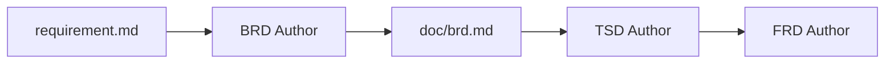

> 🟡 **OPTIONAL INDIVIDUAL-AGENT PATH** — Exercise 02 already generates `doc/brd.md`, `doc/tsd.md`, and `doc/frd.md` through the SDLC Docs Orchestrator. Use Exercises 03-05 only if you want to run each specialist agent independently.
>
> **Return to mandatory track**: [Exercise 06 — Plan Mode & Implementation Prompt](exercise-06-plan-mode.md)

# Exercise 03 (Optional) — Explore the BRD Agent in Isolation

**Duration**: 4 minutes  
**Copilot Feature**: BRD Custom Agent  
**Goal**: Understand how the BRD Agent converts the requirement into focused business requirements for create task and list tasks.

---

## What This Exercise Covers

The **BRD Author** agent reads the source requirement and creates the business requirements document. In the individual-agent path, this is the first handoff in the SDLC chain:



This exercise scopes the BRD to exactly:

| # | Feature | Endpoint |
|---|---------|----------|
| 1 | Create a task | `POST /api/v1/tasks` |
| 2 | List tasks with filters | `GET /api/v1/tasks` |

Scoping upfront keeps the document concise and token-efficient. The TSD, FRD, API, UI, and tests will trace back to these two business requirements.

---

## Step 1 — Select the BRD Author Agent

1. Open Copilot Chat (`Ctrl+Alt+I`)
2. Click the **agent selector** and choose **BRD Author**

---

## Step 2 — Send the Scoped BRD Prompt

```
Read #requirement.md. Create doc/brd.md focused ONLY on:
1. POST /api/v1/tasks — create a task
2. GET /api/v1/tasks — list tasks with optional filters: status, priority, assignedUserId

Include:
- BR-F01 for create task
- BR-F02 for list tasks
- Stakeholders
- Business rules
- Risks and mitigations
- Glossary

Do not include unrelated ITMS features.
```

---

## Step 3 — Review the Plan

Copilot will show a plan before creating or updating `doc/brd.md`. Confirm:
- [ ] It reads `requirement.md`
- [ ] It creates or updates only `doc/brd.md`
- [ ] It scopes the BRD to create task and list tasks only
- [ ] It does not create `doc/tsd.md`, `doc/frd.md`, or application code

Click **Continue** to run the BRD agent.

---

## Step 4 — Verify the Output

Once complete, check `doc/brd.md`:

```
doc/
└── brd.md    ← Business requirements for create + list tasks
```

- [ ] `BR-F01` describes create task
- [ ] `BR-F02` describes list tasks with filters
- [ ] Stakeholders, risks, mitigations, and glossary are present
- [ ] No unrelated features are added

---

## Key Takeaway

> The BRD agent turns the raw requirement into business-level scope. The next specialist agent, TSD Author, will read this BRD and convert it into architecture and API design.

---

**Next in the optional individual-agent path**: [Exercise 04 — Explore the TSD Agent in Isolation](exercise-04-tsd.md)

**Return to mandatory track**: [Exercise 06 — Plan Mode & Implementation Prompt](exercise-06-plan-mode.md)
